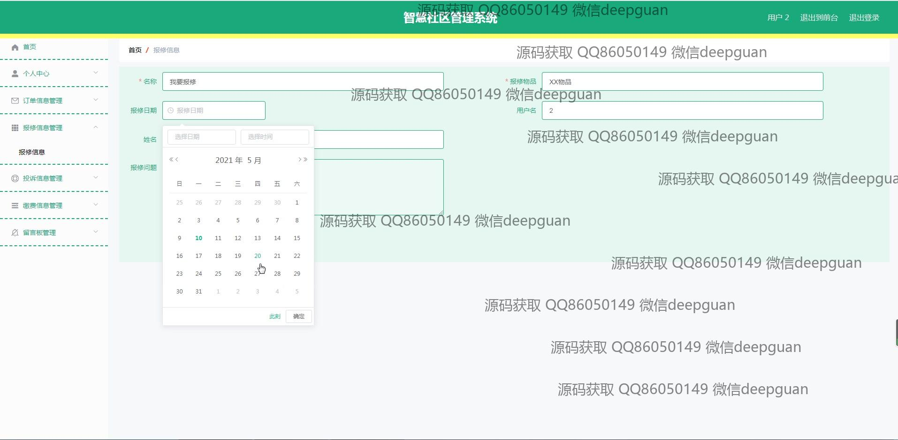
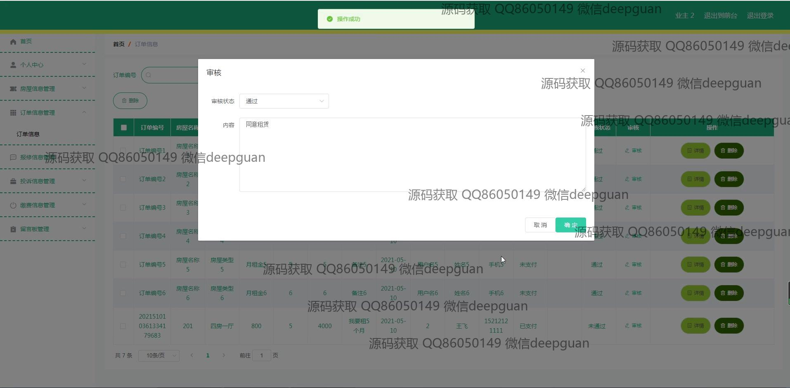

<h1 align="center">的智慧社区报修房屋缴费管理系统vue</h1>

## 简介
智慧社区管理系统：角色分为管理员、用户、业主；功能包括个人信息管理、房屋信息管理、报修管理、缴费管理、投诉管理、公告发布、订单管理等。    --计算机毕业设计源码；毕设源码；java毕业设计源码

## 联系方式

<h3 align="center">获取完整代码与数据库文件 + 微信：deepguan QQ: 86050149 QQ群: 783742310</h3>

<h3 align="center">可帮忙远程部署 包运行成功！提供远程部署、修改代码、设计文档指导、代码讲解等服务！</h3>

## 功能介绍（完整见运行截图）
管理员：基本功能包括登录、注册和退出。系统提供用户管理、业主管理、公告信息管理、房屋信息管理、订单信息管理、报修信息管理、投诉信息管理和缴费信息管理等模块。管理员可以发布和编辑公告，包括标题、类型、图片上传和内容设置。后台管理功能让管理员能够审核、修改和删除投诉记录，管理订单信息，并处理缴费详细信息。个人中心允许查看和更新管理员个人信息。

用户：用户具备登录和注册功能。在系统中，用户可以查看和管理个人中心信息，包括用户名、姓名、身份证号码、手机号码和头像上传。用户能够管理和查看房屋信息，如房屋类型、面积、月租金、详细地址等，还可以进行收藏。系统提供公告信息、房屋信息、新闻资讯和留言反馈功能，用户可以浏览和查看这些信息发布，提交报修、投诉及缴费申请，并查看其状态与详细信息等操作。

## 运行截图

本代码来源于网络,仅供学习参考使用!

